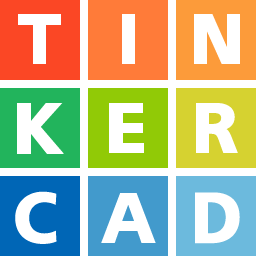
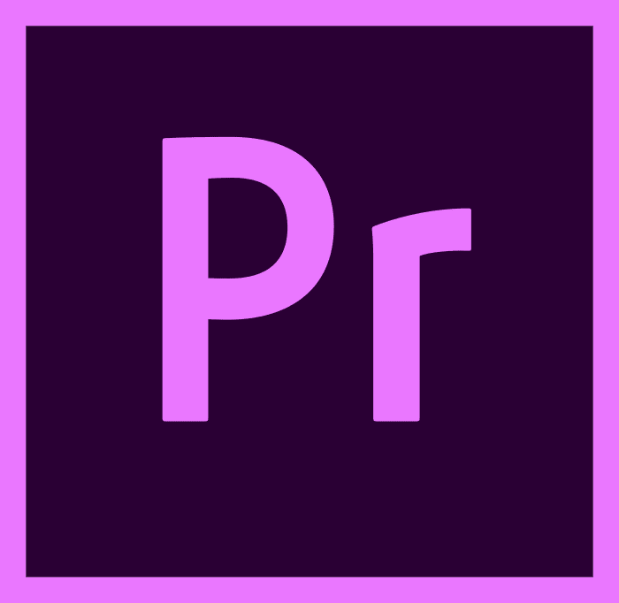

# Fire 🔥  
  

  

### Hello World!  
I'm an indie developer who dedicates the majority of my free time to developing applications and exploring new subjects that pique my interest. Programming, whether in the realm of applications or games, is a profound passion of mine.

At present, I specialize in backend web development and am actively seeking job opportunities. My focus is on crafting lightweight yet robust applications, driven by my unwavering commitment to delivering high-quality performance.  

   

## Snapshots  
  

- 👨🏻‍💻 I’m currently working on planning for my next project.  
  

- ✏ I’m currently learning ReactJS, PHP, XAMPP, Blender, and Unity.  
  

- 🔍 I desire learning programming principles and best practices.  
  

- 💬 "Everything is possible, we just lack knowledge about it."  
  

   

## Languages and Tools  

    
    
    
    
      
      
      
      
      
    
    
    
    
    
      
     
      
      
      
    
      
     
      
      
      
      
      
      
      
      
      
      
      
      
      
     
    

  

   

## Github Stats  

<picture>

</picture>
<picture>

</picture>